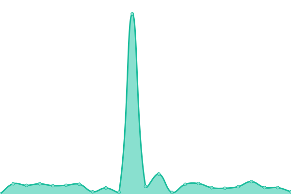
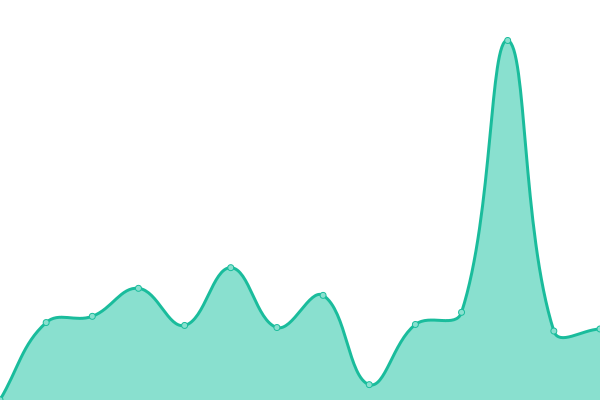

# [📈 Live Status](https://stupldstuff.github.io/upptime): <!--live status--> **🟩 All systems operational**

<!--start: status pages-->
<!-- This summary is generated by Upptime (https://github.com/upptime/upptime) -->
<!-- Do not edit this manually, your changes will be overwritten -->
<!-- prettier-ignore -->
| URL | Status | History | Response Time | Uptime |
| --- | ------ | ------- | ------------- | ------ |
|  git | 🟩 Up | [git.yml](https://github.com/aeqe/upptime/commits/HEAD/history/git.yml) | 

 528ms
     
 | 

<a href="https://stupldstuff.github.io/upptime/history/git">99.53%</a>
    

|  [r6](https://r6.patriick.dev) | 🟩 Up | [r6.yml](https://github.com/aeqe/upptime/commits/HEAD/history/r6.yml) | 

 482ms
     
 | 

<a href="https://stupldstuff.github.io/upptime/history/r6">99.53%</a>
    

<!--end: status pages-->

[**Visit our status website →**](https://stupldstuff.github.io/upptime)

## 📄 License

- Powered by: [Upptime](https://github.com/upptime/upptime)
- Code: [MIT](./LICENSE) © [Upptime](https://upptime.js.org)
- Data in the `./history` directory: [Open Database License](https://opendatacommons.org/licenses/odbl/1-0/)
