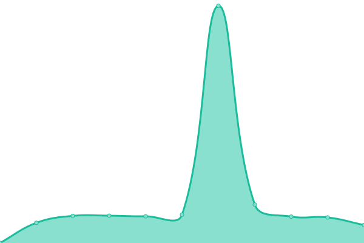

# [📈 Live Status](https://stupldstuff.github.io/upptime): <!--live status--> **🟩 All systems operational**

<!--start: status pages-->
<!-- This summary is generated by Upptime (https://github.com/upptime/upptime) -->
<!-- Do not edit this manually, your changes will be overwritten -->
<!-- prettier-ignore -->
| URL | Status | History | Response Time | Uptime |
| --- | ------ | ------- | ------------- | ------ |
|  rudi | 🟩 Up | [rudi.yml](https://github.com/StUpldStuff/upptime/commits/HEAD/history/rudi.yml) | 

 256ms
     
 | 

<a href="https://stupldstuff.github.io/upptime/history/rudi">100.00%</a>
    

|  rudi vercel | 🟩 Up | [rudi-vercel.yml](https://github.com/StUpldStuff/upptime/commits/HEAD/history/rudi-vercel.yml) | 

 778ms
     
 | 

<a href="https://stupldstuff.github.io/upptime/history/rudi-vercel">100.00%</a>
    

|  [blog](https://b.zimpatrick.gq) | 🟩 Up | [blog.yml](https://github.com/StUpldStuff/upptime/commits/HEAD/history/blog.yml) | 

 755ms
     
 | 

<a href="https://stupldstuff.github.io/upptime/history/blog">100.00%</a>
    

|  [wummy (für freund)](https://wummy.one/) | 🟩 Up | [wummy-fuer-freund.yml](https://github.com/StUpldStuff/upptime/commits/HEAD/history/wummy-fuer-freund.yml) | 

 342ms
     
 | 

<a href="https://stupldstuff.github.io/upptime/history/wummy-fuer-freund">100.00%</a>
    

<!--end: status pages-->

[**Visit our status website →**](https://stupldstuff.github.io/upptime)

## 📄 License

- Powered by: [Upptime](https://github.com/upptime/upptime)
- Code: [MIT](./LICENSE) © [Upptime](https://upptime.js.org)
- Data in the `./history` directory: [Open Database License](https://opendatacommons.org/licenses/odbl/1-0/)
